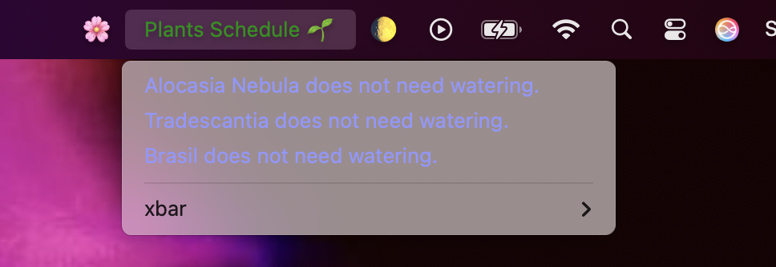

# Plant Watering Reminder Plugin 🌱

This is a simple yet powerful plugin for the macOS xbar application that reminds you when to water your plants. It tracks the last watered date and alerts you when it's time to give your plants some love.

## Features:

Displays a list of plants and their watering schedule in the macOS menu bar.
Highlights which plants need watering with a red alert and shows the next watering date for plants that don’t need watering yet.
Tracks each plant's watering interval, so you never forget when it's time to water your green friends.

### Installation

### Code Overview

Plant Class
Attributes:
name: The name of the plant (e.g., "Alocasia Nebula").
last_watered: The date the plant was last watered (in "YYYY-MM-DD" format).
watering_interval: The number of days between each watering.
Methods:
needs_watering?(current_date): Checks whether the plant needs watering based on the current date and watering interval.
days_until_next_watering(current_date): Returns how many days until the next watering if the plant doesn't need watering yet.
parse_date(date_str): Helper method to safely parse the date input and handle errors gracefully.
